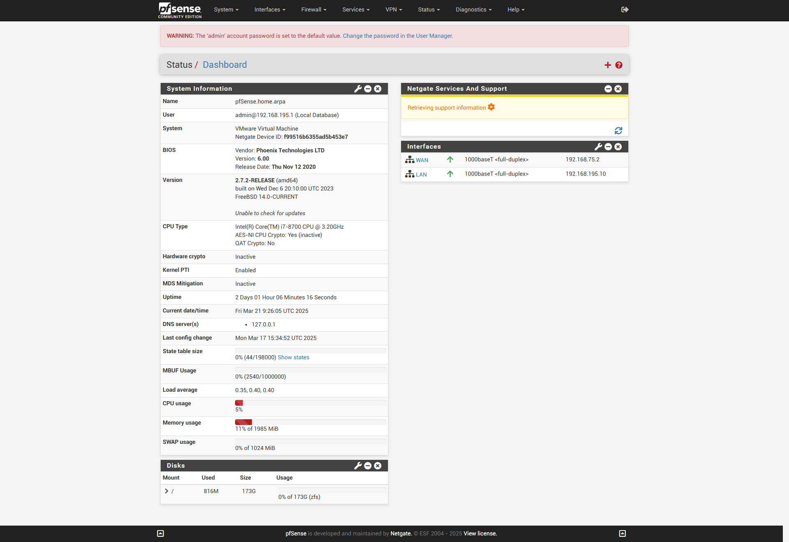

# Pare-feu PFsense

### Marche à suivre lors de la création de règles

Lorsque l'on veut autoriser des connexions, l'idéal est d'utiliser Wireshark (ou un autre sniffer) et d'autoriser petit à petit les ports et protocoles nécessaires au service que l'on souhaite mettre en place. L'ajout de descriptions dans les alias et dans les règles mises en place est primordial pour faciliter la compréhension globale.  
Les alias sont très utiles également pour limiter le nombre de règles faisant référence à un même protocole.

#### Autorisation d'un réseau à accéder à un serveur web présent dans une DMZ

La démarche étant sensiblement la même pour autoriser un accès à Internet, elle ne sera pas détaillée ici.

Pour l'accès à Internet, trois protocoles sont utilisés :
- DNS (port 53)
- HTTP (port 80)
- HTTPS (port 443)

Créez donc un alias contenant les ports 80 et 443 que vous pourrez nommer : "internet".  
Puis créez deux règles :
- Une contenant l'autorisation du poste/réseau en TCP/UDP vers votre serveur DNS.
- Une seconde contenant l'autorisation du poste/réseau vers les ports de l'alias précédemment créé (c'est-à-dire "internet").

#### Autorisations nécessaires pour permettre de rejoindre un domaine Active Directory

Il y aura plusieurs protocoles à autoriser pour ce service :
- **Kerberos**
  - Port 88 TCP & UDP
- **DNS**
  - Port 53 TCP & UDP
- **RPC**
  - Port 135 TCP & UDP
- **RPC Dynamic**
  - De 49135 à 65535 TCP
- **LDAP**
  - Port 389 TCP & UDP
- **LDAPS**
  - Port 636 TCP
- **SMB**
  - Port 137, 138 UDP ?
  - Port 139, 445 TCP ?
- **ICMP**

Il est important d'ajouter en dernière ligne :  
`deny any any`  
Pour empêcher tout autre protocole de passer après ceux qui ont été autorisés.

  

