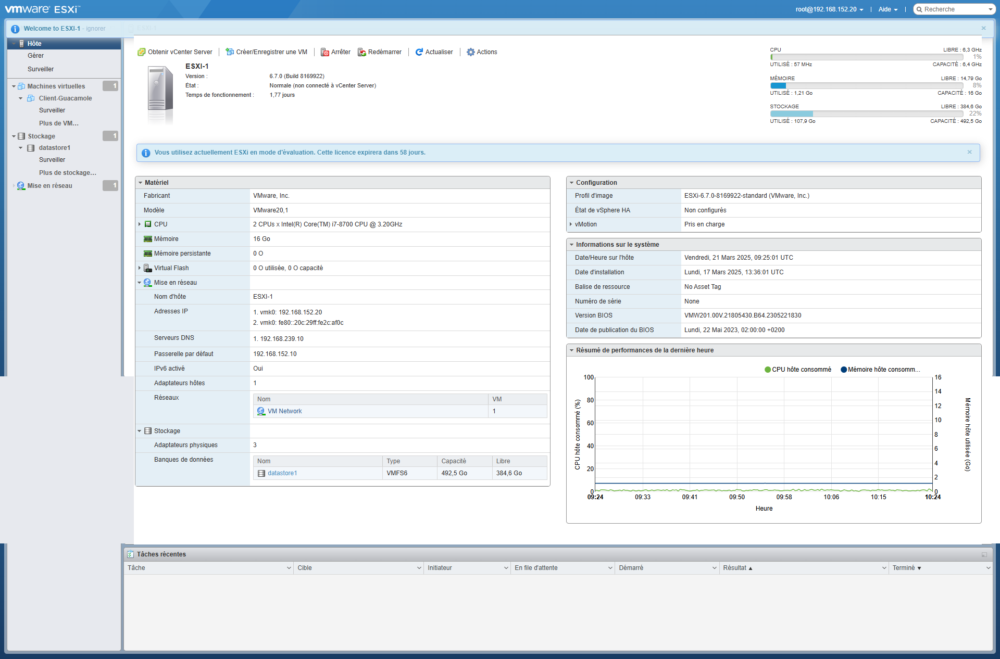

# Notions de Sécurité Système et Réseaux

## 1. Création d'un serveur PfSense

### Configuration des cartes réseaux

1. **NAT** → `em0`
2. **Custom vmnet2** → `em1` (Client Windows) → `192.168.10.10`
3. **Custom vmnet3** → `em2` (Windows Server) → `192.168.20.10`
4. **Custom vmnet4** → `em3` (Linux) → `192.168.30.10`

### Installation et Configuration de PfSense

- **VLANs** : Non
- **Interfaces** :
  - **WAN** → `em0`
  - **LAN (Client Windows)** → `em1`
  - **WINDOWSSERVER** → `em2`
  - **DMZ** → `em3`
- **Assignation des IPs** :

| Interface  | Adresse IP        | Masque       | Passerelle       | DNS préféré    |
|------------|------------------|--------------|------------------|---------------|
| WAN        | `192.168.75.10`  | -            | NAT (Vmnet8)     | -             |
| LAN        | `192.168.10.20`  | `255.255.255.0` | `192.168.10.10` | `192.168.20.20` |
| Windows Server | `192.168.20.20` | `255.255.255.0` | `192.168.20.10` | `192.168.20.20` |
| DMZ (Linux) | `192.168.30.20` | `255.255.255.0` | `192.168.30.10` | - |

### Configuration du Pare-feu PfSense

- **Accès PfSense** : `https://192.168.10.10/`
- **Règles Firewall** :
  - **WINDOWSSERVER**
    - ICMP → Any
    - ICMP → Any → Destination `WINDOWSSERVER address`
  - **DMZ**
    - ICMP → Any

---

## 2. Création du Windows Server

- **Configuration réseau** :
  - Assigner les adresses IP
  - Désactiver IPv6
- **Ajout des rôles** :
  - **AD DS** (Active Directory Domain Services)
  - **DNS** (Création du domaine)
- **Ajout des droits utilisateur** :
  - `Membre de` → `con` → `Ctrl + A` → Valider
  - `Membre de` → `adm` → `Ctrl + A` → Valider

---

## 3. Création du Windows Client

- **Configuration réseau** :
  - Désactiver IPv6
  - Assigner les adresses IP
  - Changer uniquement le nom de l'ordinateur (pas besoin de mettre le domaine)
- **Accès à Internet** :
  - **Firewall → Rules → WINDOWSSERVER**
    - TCP/UDP → Source `WINDOWSSERVER subnets` → Destination Any & DNS (53)
    - TCP/UDP → Any
  - **Firewall → Rules → LAN**
    - TCP → Source `192.168.10.20` → Destination invert match LAN subnets HTTP (80)
    - TCP → Source `192.168.10.20` → Destination invert match LAN subnets HTTPS (443)
    - TCP/UDP → Any

### Joindre un domaine

- **Firewall → Rules → WINDOWSSERVER**
  - DNS (53) TCP/UDP
  - HTTP (80) TCP
  - HTTPS (443) TCP
  - KERBEROS (88) TCP/UDP
  - LDAP (389) TCP/UDP
  - LDAPS (636) TCP
  - SMB (137, 138) UDP (139, 445) TCP
  - RPC (135) TCP/UDP
  - LEMP
  - DYNAMIC (49152-65535) TCP
- **Firewall → Rules → LAN**
  - Même règles que pour `WINDOWSSERVER`

---

## 4. Création Linux Debian

- **Configuration réseau** :
  - `ip addr add <ip>/<masque> dev ens33`
  - `ip add default via <ip>`
- **Vérification** :
  - `ip a`
  - `ip route show`

---

## 5. Liste des Protocoles

| Protocole | Port(s) | Description |
|-----------|--------|-------------|
| **DNS** | 53 TCP/UDP | Traduction des noms de domaine en adresses IP |
| **HTTP** | 80 TCP | Navigation web non sécurisée |
| **HTTPS** | 443 TCP | Navigation web sécurisée (SSL/TLS) |
| **KERBEROS** | 88 TCP/UDP | Authentification sécurisée sur le réseau |
| **LDAP** | 389 TCP/UDP | Gestion des annuaires réseau (ex : comptes utilisateurs) |
| **LDAPS** | 636 TCP | Version sécurisée de LDAP (SSL/TLS) |
| **SMB** | 137, 138 UDP / 139, 445 TCP | Partage de fichiers et imprimantes sur Windows |
| **RPC** | 135 TCP/UDP | Exécution de services distants |
| **LEMP** | - | Stack web Linux (Linux, Nginx, MySQL/MariaDB, PHP) |
| **DYNAMIC** | 49152-65535 TCP | Ports pour connexions temporaires (sessions éphémères) |

---

🎯 **Ce document récapitule la mise en place d'un environnement sécurisé avec PfSense, Windows Server, Windows Client et Debian, incluant la configuration réseau et firewall.**

  

  

